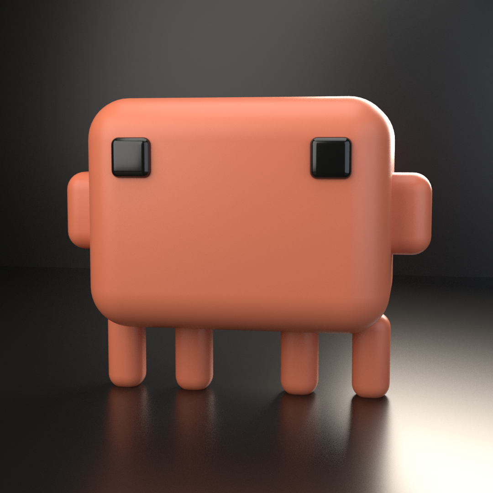
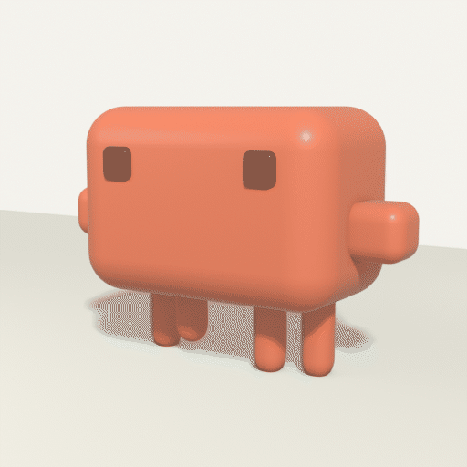
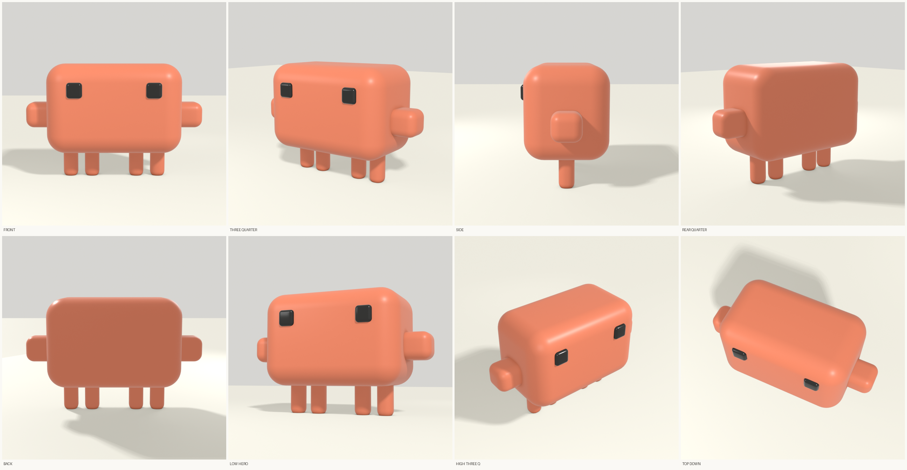
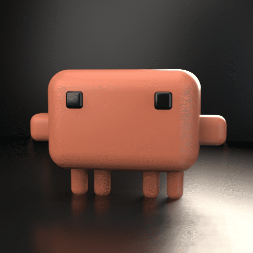

# Clawd in 3D

A smooth 3D interpretation of Clawd — the Claude Code mascot — built entirely
from Python in headless Blender. No GUI, no manual modelling, no `.blend` file:
the scene is constructed from scratch on every run and path-traced to a PNG.



## Running it

Needs Blender on `PATH` (developed against **4.0.2** from Ubuntu `noble/universe`):

```bash
apt-get install -y blender          # run apt-get update first if fetches 404
blender --background --python mascot.py
```

Output goes to `out/clawd.png`, or override with `CLAWD_OUT=/path/to.png`.

For a five-angle contact sheet (front / three-quarter / side / back / top):

```bash
blender --background --python angles.py     # -> out/angles/*.png
```

`angles.py` imports `mascot.py` to reuse the scene, so one Blender launch
renders every view. `mascot.py` guards its own render behind
`if __name__ == "__main__"` to make that work.

Roughly 4–5 minutes for the hero render on 4 CPU cores; the angle sheet is
faster because it drops resolution and samples.

### Walk cycle



```bash
blender --background --python walk.py                                  # -> out/walk/
CLAWD_ANIM_OUT=out/walk CLAWD_GIF_BASE=walk python3 make_gif.py        # -> walk.gif
```

A sequential **wave gait**: each leg is offset a quarter cycle from its
neighbour so a ripple travels along the row, plus two body bobs per loop, a
lateral sway, and claw follow-through. The legs sit in a single row because
that is what the sprite shows, and a wave suits that shape far better than a
quadruped trot — it reads as crustacean, which is apt for a crab.

Walking is in place. Translating the body would carry it out of frame in about
two seconds and break the loop.

Making the step legible took four changes, and the least obvious one mattered
most:

1. **A light floor.** On the original near-black stage the gap under a raised
   foot was dark-on-dark and simply invisible. Against `#e8e6dc`, with a
   contact shadow that separates from the lifted foot, the step reads
   instantly. This was worth more than any animation tweak.
2. **A three-quarter camera (32°).** A walk reads best from the side, but a
   pure side view collapses all four legs into one silhouette because they
   share a depth. 32° shows the wave travelling along the row *and* the
   fore/aft swing together.
3. **The waddle carries it, not the legs.** Raising a leg always shortens its
   visible length by the lift amount, so with stubby legs a big lift reads as
   retraction into the body. A taller stance fixes that and makes Clawd
   spindly, losing proportions that are on-brand — so `STAND` stays low at
   0.14 and the lateral sway does the work instead. For a short-legged
   creature, a waddle *is* what walking looks like.
4. **Bigger amplitudes.** The first pass was too timid to read at 512px.

`_assert_loops()` verifies numerically at import that the motion functions are
continuous across the cycle boundary. A seam is invisible frame-by-frame and
obvious in playback, so it is checked rather than assumed.

## Action library

`actions.py` holds a `Rig` plus a registry of named moves. Each action is a
pure function of phase, so adding one is a single function plus a registry
entry.

```bash
blender --background --python actions.py                       # render all
CLAWD_ACTION=jump blender --background --python actions.py     # just one
CLAWD_ANIM_OUT=out/jump CLAWD_GIF_BASE=jump python3 make_gif.py
```

| Action | Frames | |
|---|---|---|
| `idle` | 48 | breathing bob, arm follow-through, two blinks |
| `walk` | 48 | four-leg wave gait with a waddle |
| `jump` | 42 | crouch, launch, airborne arc, landing squash, settle |
| `wave` | 40 | right claw raised and rocking |
| `look` | 44 | eyes glance left and right across the face |
| `dance` | 36 | two-beat bounce, alternating legs and claws |
| `sleep` | 48 | slow deep breathing, eyes shut |
| `turntable` | 48 | static pose, camera orbits 360° |

Whole batch is ~354 frames, about 27 minutes.

### Why a rig rather than a script per move

Squash and stretch is the case that demands it. Body, eyes and arms are
separate objects, so scaling the body alone slides the face out from under the
eyes. `Rig.apply()` re-derives every attached part's position from the body's
current scale, so squash composes with everything else for free.

Legs are the other reason. They deliberately do **not** follow torso sway —
that contrast is what makes a waddle read as a waddle. But a rigid leg under a
*rising* body has only bad options: translate it and the foot leaves the
ground, or leave it and the leg tears off at the hip. The first version of
`jump` did the latter and rendered four capsules floating under an airborne
body. So vertical follow is opt-in per action:

- `rig.leg(i, lift=...)` — travels with the body (used for the airborne tuck)
- `rig.leg_planted(i, body_dz)` — **stretches** the leg so the foot stays down
  while the hip rises. Poor man's IK, and what `dance` uses for its planted
  pair.

`_assert_loops()` checks every registered action for seam continuity by
comparing the accumulated pose at phase 0 against phase ~1. A seam is
invisible frame-by-frame and glaring in playback, so it is verified rather
than assumed.

### Sampling

16 EEVEE samples, not 32. Measured 4.7 s/frame against 8.1 s, for a mean
absolute difference of **0.08/255** across 5.5% of pixels — imperceptible, and
it halves a 350-frame batch. Resolution is *not* the lever: 320 px cost 6.7 s
against 512 px's 8.1 s, so per-frame overhead dominates pixel count.

## Angles



```bash
blender --background --python angles.py      # -> out/angles/*.png
```

Eight views in one Blender launch. Note what the side view shows: all four
legs collapse into a single silhouette, because they share a depth. That is
faithful to a flat sprite and is the clearest illustration of the authored-
depth caveat above.

## Staging

`stage.py` restages `mascot.py`'s scene. Import the model, then apply a setup:

```python
import mascot, stage
stage.light_studio()
```

`light_studio()` is the bright, friendly setup used by the walk cycle:
`#faf9f5` world, `#e8e6dc` floor, soft shadows, rim light nearly off (rim
exists to separate a subject from a dark background; on light it only adds
glare). The stills still use the original dark stage.

Two lighting lessons are baked into it, both learned by getting them wrong:

- **Emitter size can kill a shadow.** At `size >= 8` the key's shadow was so
  diffuse it vanished and the character read as floating. The key sits at 4.0;
  the fills stay large and soft.
- **Area lamps cannot ground a subject at this scale.** They fall off with
  distance, so at ~9 units they lose to a bright world and the contact shadow
  washes out regardless of wattage — 720 W barely registered. A **sun** fixes
  it: parallel rays, distance-independent irradiance, and `angle` controls
  softness directly.

## Exporting the model

```bash
apt-get install -y python3-numpy            # the glTF exporter needs it
blender --background --python export_glb.py  # -> out/clawd.glb
```

`clawd.glb` is committed at the top level — 9 objects, 9,804 triangles, 212 KB,
glTF 2.0, loadable in three.js, `<model-viewer>`, Godot, or anything else that
reads the format. Only the character is exported; the floor, backdrop, lights
and camera are staging for the stills and would be unhelpful in someone else's
scene. Modifiers are applied on export, so the Bevel that does all the rounding
is baked into the delivered mesh rather than lost.

Note the exporter fails with `ModuleNotFoundError: No module named 'numpy'`
without that package. Blender here runs its own Python **3.12.3**, which is not
the `python3` on `PATH` — `python3-numpy` from apt lands somewhere Blender can
see it, but a `pip install` into a different interpreter will not.

## Animation



A seamless 48-frame idle loop — breathing bob, arm follow-through, two blinks:

```bash
apt-get install -y libegl1 libgl1-mesa-dri libglx-mesa0 libgbm1   # see below
blender --background --python animate.py     # -> out/idle/f000.png ...
python3 make_gif.py                          # -> idle.gif + idle.webp
```

About 8 s/frame at 512², so ~6 minutes for the loop. Motion is computed per
frame in Python rather than keyframed: procedural sine motion is periodic by
definition, so the loop closes seamlessly with no F-curve interpolation to
fight. Frames are gitignored; only the assembled GIF/WebP are committed.

### Animation renders in EEVEE, and why

Measured here at 480² with matched settings: **EEVEE ~18 s/frame, Cycles
~21–25 s/frame**. Effectively a tie — there is no GPU, so EEVEE rasterises
through Mesa's llvmpipe on the same 4 cores. Speed is *not* the reason to
pick it.

The reason is noise. EEVEE is rasterised and has no Monte Carlo grain at all,
so frames are temporally stable. Cycles' grain re-randomises every frame and
visibly crawls during playback; the normal fix is a denoiser, which this build
does not have. Hence EEVEE for animation, Cycles for hero stills.

### EEVEE on a headless box

EEVEE needs a GL context, which a headless container has no obvious way to
provide. It works anyway because Blender ships with EGL support compiled in
and falls back to **surfaceless EGL** — no X server and no Xvfb required. The
libraries are not installed by default, which presents as:

```
Couldn't open libEGL.so.1: cannot open shared object file
```

Installing `libegl1 libgl1-mesa-dri libglx-mesa0 libgbm1` fixes it. Expect
this on stderr afterwards:

```
EGL Error (0x3001): EGL_NOT_INITIALIZED ...
EGL Error (0x3009): EGL_BAD_MATCH ...
Managed to successfully fallback to surfaceless EGL rendering!
```

Those errors are the fallback working as designed, not a broken build.

## Proportions: hand-tuned, informed by the SVG

The mascot's canonical SVG `<rect>` list is:

```
bdy         x=11  y=0   w=85  h=65      -> body 1.31:1
left-hand   x=0   y=21  w=22  h=23     right-hand  x=85  y=21  w=22  h=23
right-eyes  x=21  y=11  w=11  h=11     left-eyes   x=75  y=11  w=11  h=11
leg1..4     x=11, 32, 64, 85    y=60   w=11  h=26
```

A version built strictly to those numbers, scaled through a single `UNIT`
constant, is in the git history. It is more literally accurate and looks
worse: the 1.31:1 body reads cramped once it is lit and shaded, where the
flat sprite it came from has no shading to contend with. The committed
proportions are therefore **hand-tuned** — a wider **1.5:1** body, with eyes
and legs sized by eye.

What is taken from the SVG and not up for debate: the eyes are **square**
(vertical slots read as an appliance, not a creature), and the four legs form
a **row with a centre gap**, matching both the rect list and the terminal
sprite's bottom row `▘▘ ▝▝` — not a 2×2 grid.

So: silhouette and topology follow the source, exact ratios follow the eye.

## Depth is authored, not derived

**Every published reference for Clawd is front-facing.** There is no side view,
no turnaround, no 3D source. So width and height at least have a source to
argue with, while the depth axis has none — `BODY_D` and the arm depth are
pure authorial choice, marked `AUTHORED` in the source.

This has a visible consequence: because all four legs sit at the same depth,
the side view collapses them into a single silhouette. That is faithful to a
flat sprite and implausible as a creature. Spreading the legs front-to-back
would look better in 3D and be less true to the source — a design decision,
not a bug, and deliberately left as-is.

## Two Blender gotchas worth recording

**Base Color is linear.** Feeding sRGB hex straight into a Principled BSDF
desaturates everything. `srgb_to_linear()` handles the conversion.

**The default view transform will shift a brand colour.** Blender 4.x defaults
to AgX, a filmic tone map that is lovely for photography and wrong for brand
accuracy — it visibly pushes the terracotta off-hue. The scene forces
`view_transform = "Standard"`. The tradeoff is no highlight rolloff, so an
over-bright key light clips hard to white instead of rolling off gracefully;
the lighting is dialled back to suit.

Also: Ubuntu's Blender is compiled **without** OpenImageDenoise, so setting
`cycles.use_denoising = True` raises `RuntimeError: Build without
OpenImageDenoiser` rather than warning. Samples plus a tight adaptive
threshold do the job instead.

## Colours

Anthropic brand values — `#d97757` body, `#141413` eyes and stage. The
mascot's own SVG uses `#DD775B`, a hair warmer; the brand value is used here
deliberately.
